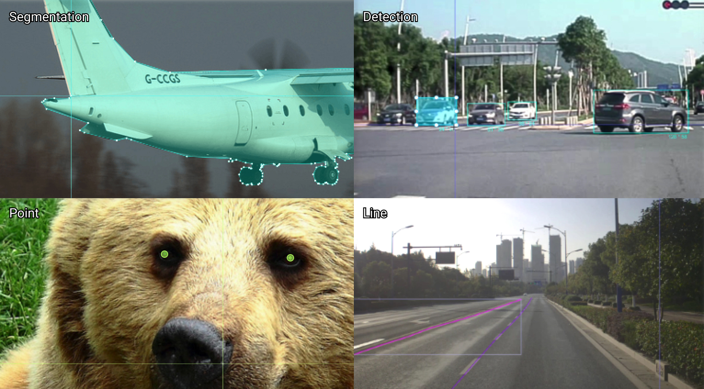

<div align="center">
<article style="display: flex; flex-direction: column; align-items: center; justify-content: center;">
    <p align="center"></p>
    <h1 style="width: 100%; text-align: center;">LabelBee-Client</h1>
    <p>
        <a href="https://github.com/open-mmlab/labelbee-client/releases">Releases</a>
        ·
        <a href="#特性" >Usage</a>
        ·
        <a href="./README.md" >English</a>
    </p>
</article>


</div>

## 特性

- 📦 开箱即用，内置 6 款通用的标注工具，仅需简单配置即可标注
- 🪵 任意搭配，多种工具可直接互相依赖使用$$
- 🏁 支持通用数据，COCO 格式导出，语义分割 Mask 导出
- 💻 全平台支持：Mac / Linux / Windows

## 客户端下载

[Mac](https://github.com/open-mmlab/labelbee-client/releases/download/v0.1.0/labelbee-client-0.1.0.dmg) / [Windows](https://github.com/open-mmlab/labelbee-client/releases/download/v0.1.0/labelbee-client.Setup.0.1.0.exe) / [Linux](https://github.com/open-mmlab/labelbee-client/releases/download/v0.1.0/labelbee-client_0.1.0_amd64.deb)

## 支持场景


- 目标检测：车辆、车牌、行人、人脸、工业部件等检测场景
- 目标分类：检测对象分类、目标特征、是非判断等分类场景
- 语义分割：人体分割、全景分割、可行驶区域分割、车辆分割等
- 文本转写：车牌、发票、保单、招牌等文本检测和识别
- 轮廓线检测：人体轮廓线、车道线等定位线场景
- 关键点检测：人脸人体关键点、车辆关键点、路沿关键点等定位场景


<div align="center">
  

  <i style="text-align: center;">Detection / Segmentation </i>
  
  

  <i style="text-align: center;">Line / Point / Text </i>
</p> 
</div>

## 快速上手

 [基础流程创建](./docs/README.md) 

## 标注格式说明

```json
{
  "width": 4368,
  "height": 2912,
  "valid": true,
  "rotate": 0,
  "step_1": {
    "toolName": "rectTool",
    "result": [
      {
        "x": 530.7826086956522,
        "y": 1149.217391304348,
        "width": 1314.7826086956522,
        "height": 1655.6521739130435,
        "attribute": "",
        "valid": true,
        "id": "Rp1x6bZs",
        "sourceID": "",
        "textAttribute": "",
        "order": 1
      }
    ]
  }
```
详细细节请查看 [LabelBee 标注格式](./docs/annotation/README.md)

## 友情链接

- [LabelBee](https://github.com/open-mmlab/labelbee)（本工具都是通过 LabelBee 进行开发）

## 开源许可证

该项目使用 [Apache 2.0 license](./LICENSE).
