English | [简体中文](./README_zh-CN.md)

# Getting Started

## Concept
- Project： Create an Annotation Task, divided into two modules: `Single Step` and `Multiple Steps`
- Single Step： The first choice for creating a simple annotation task
- Multiple Step： Support multiple annotations tools, customize annotation steps and focus more on specific scene annotation

## A、Project Creation

### 1. Open the application
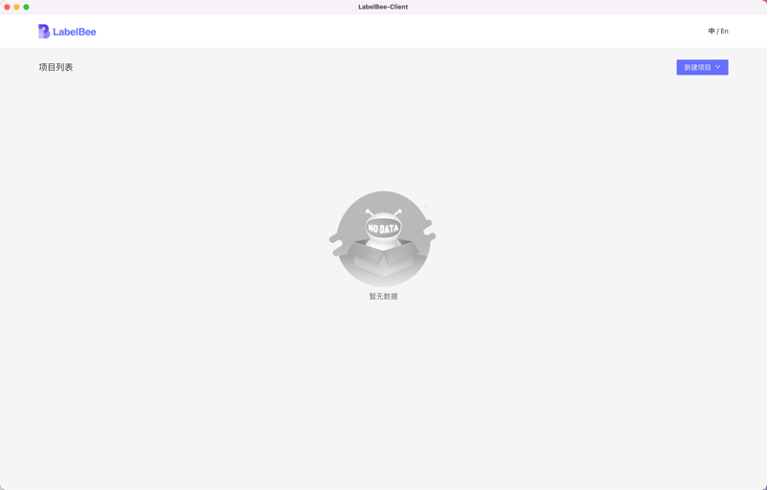

### 2. Create A Project

Click `New Project` on the top right, and select the `one step` to create a simple annotation task

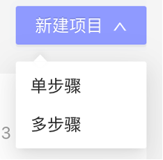

### 3. Basic Configuration

Each tool has specific configurations, both operating restrictions (minimum range of the frame)and high-level annotation configuration (text annotation, attribute annotation). The following is an example of `Detection`:

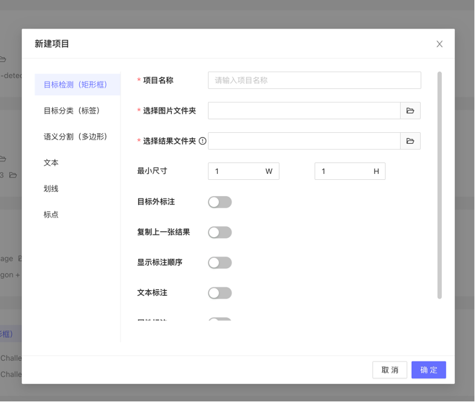

The first three configurations are required:

* a.	Project name: For display
* b.	Image path: Select the path to be annotated; LabelBee-Client will read all image files from the path, including images in nested folders
* c. Result Path: Select the save path of annotation results; Images' filenames and the path will be used as references for data storage when saving, as well as to be used as pre-labeled data injection, **Note: You need to follow the LabelBee format to display correctly strictly **, you can check for details [LabelBee format](./annotation/README.md)

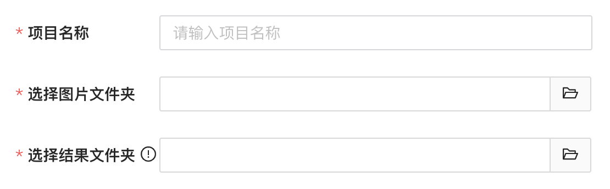

### 4. Advanced Configuration

For the basic annotation tasks, you can skip the following configurations directly.
#### a. General configurations of graphics tools

- Minimum Size: The minimum limitation range of the bounding box
- Out-Of-Target: By default, annotating outside the image is not allowed
- Copy Prev: Directly copy the annotation result from the previous picture (mainly used to annotate the frame extracting scene)
- Show Order: Display the order of annotations with bounding boxes

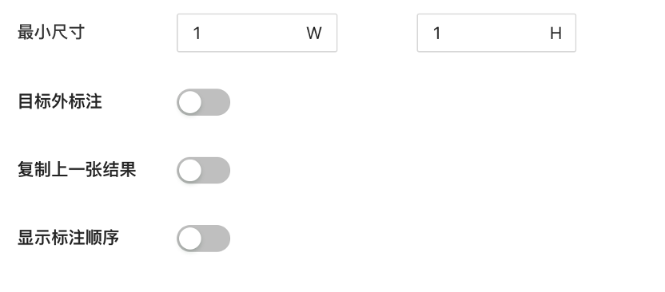

#### b. Attribute

Configure the attribute to the detection box that can be assigned. The left side of the form shows the annotation display value, while the right side shows the annotation resulting value

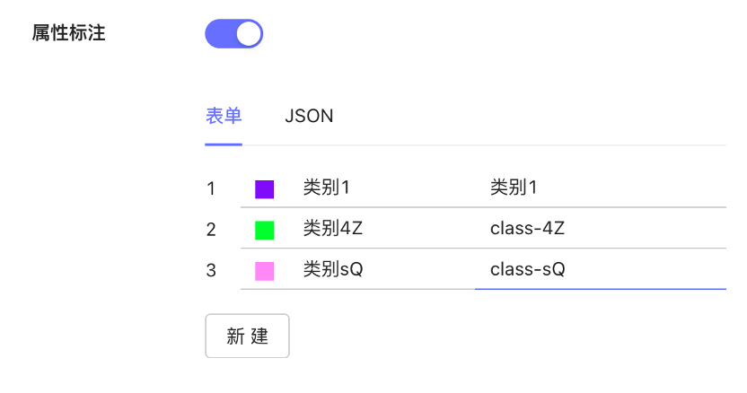

#### c. Text Annotation

Each bounding box can enter specific text and can restrict the rules of input, mainly open in the OCR scene

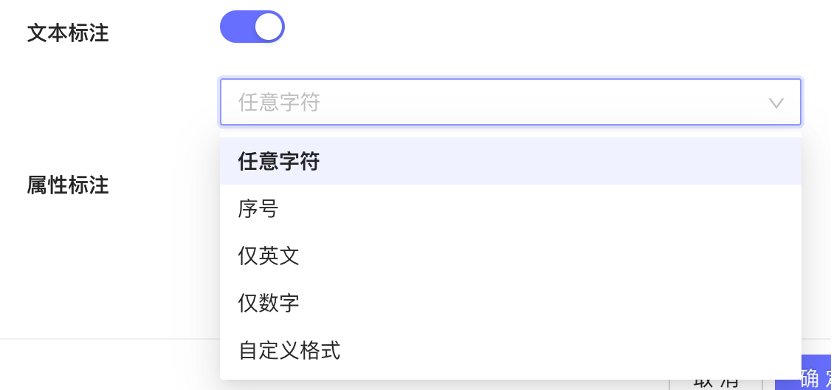

Click OK to create the project

## B、Annotation Procedure

### 1. Start the project

Click the Task Name to Start a project

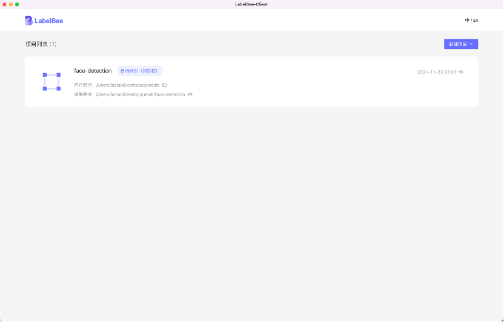

### 2. Annotation

More annotation operation details in the lower-left corner

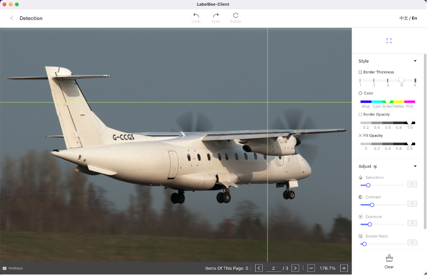

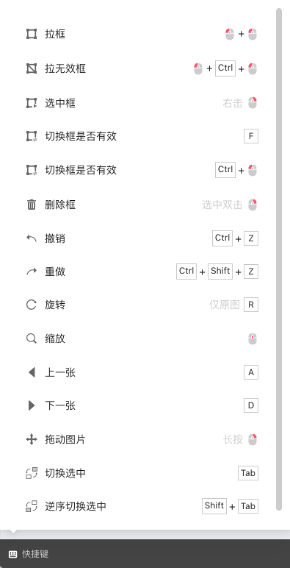

[Basic operation demonstration video](https://www.bilibili.com/video/BV1fZ4y1X7tq)

#### Basic annotation operations

- Picture switch/Result submit: Shortcut key AD to turn the page forward and backward, and it will be automatically saved to the result path
- Drag and drop the picture: Right-click and long press to move
- Zoom Image: Mouse wheel
- Annotation (Detection): left click - move - left click
- Click the backward in the upper left corner to exit the project

For other advanced operations, please refer to the shortcut keys illustration above
## C、Data Export

The data supports COCO and Mask data format to export.
### 1.Open the Export

Move the mouse to the designated task and click the first button to export in the lower right corner

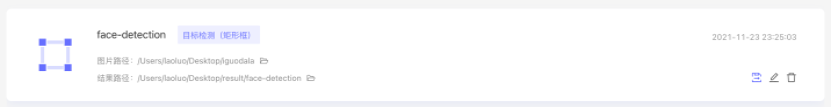

### 2. Export restrictions

- Target detection (rectangular frame): Support COCO format export
- Semantic segmentation (polygon): Support COCO, Mask format export

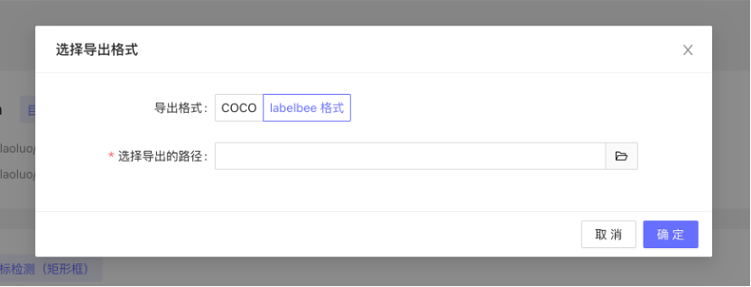

---

## D、LabelBee Format

[LabelBee Format](./annotation/README.md)
